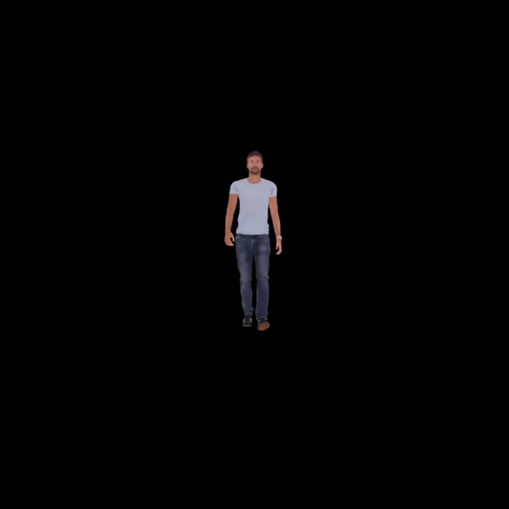

# WebGL skeletal animation


This is a skeletal animation project. It loads geometry and animation data from a `JSON` file (converted using the `assimp2json` utility). `WebGL` is used for rendering this data.

## Usage

To run the application you need to host it on a server or localhost. You can use [Web Server for Chrome](https://chrome.google.com/webstore/detail/web-server-for-chrome/ofhbbkphhbklhfoeikjpcbhemlocgigb?hl=en) extension for hosting on `chrome browser`. You can even use [http-server](https://www.npmjs.com/package/http-server).

For adding your own models, you need to convert the respective model to `JSON` format using the `assimp2json` utility (included in this project).

```javascript
// create a dynamic model
let myModel = DynamicModel("model.json");

...

// draw the dynamic model
myModel.draw(modelMatrix, viewMatrix, projectionMatrix);

...

// uninitialize
myModel.uninitialize();

``` 

## Output



## Credits

This project is based on the [Skeletal Animation](https://learnopengl.com/Guest-Articles/2020/Skeletal-Animation) tutorial.

I have used [assimp2json](https://github.com/acgessler/assimp2json) for converting my models from `fbx` to `JSON`.
